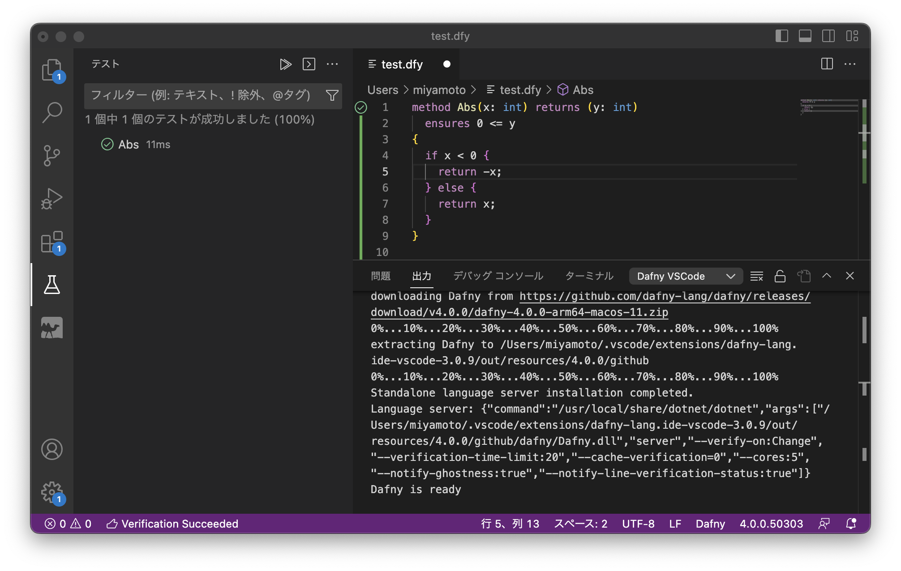
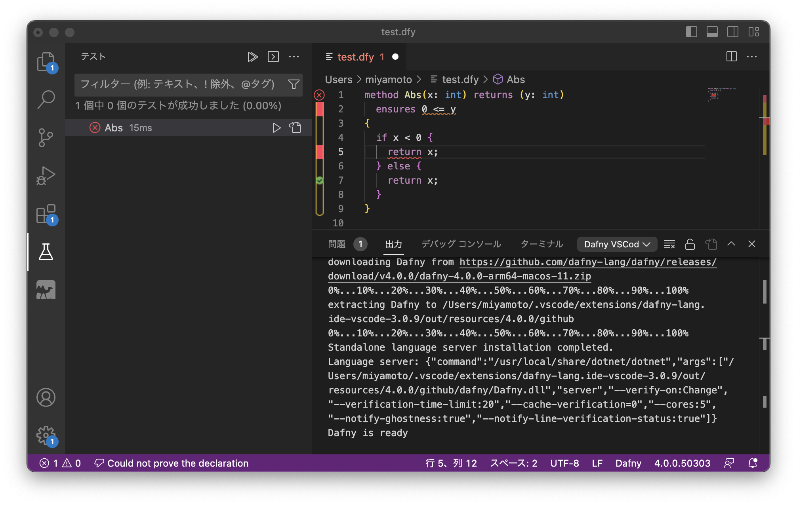

# Dafny

[Dafny](https://dafny.org) は検証可能なプログラムを書くためのプログラミング言語です。

## インストール (VSCode/Mac) と動作確認
Mac上で、VSCode で Dafny を使ってみます。多分、Mac でなくても、VSCode 上で使う場合はほとんど同じはずです。

* [Visual Studio Code](https://code.visualstudio.com) をインストールする。
* [.NET SDK](https://dotnet.microsoft.com/ja-jp/download/visual-studio-sdks) をインストールする。
* [Dafny のインストール方法](https://github.com/dafny-lang/dafny/wiki/INSTALL) の指示に従う。
   * VSCode 上で、⌘P で `ext install dafny-lang.ide-vscode.
`と入力する。
   * VSCode を再起動とかする。
* 動作確認
* VSCode上で、`test.dfy` というファイルを作る。
下記のように入力してみる。Abs 関数の実装が正しいことが、画面左の緑アイコンで確認できる。

```
method Abs(x: int) returns (y: int)
  ensures 0 <= y
{
  if x < 0 {
    return -x;
  } else {
    return x;
  }
}
```


５行目のコードを `return x` に変えると、実装ミスが指摘される。


## チュートリアル

[Getting Started with Dafny: A Guide](https://dafny.org/latest/OnlineTutorial/guide) のポイントとなる部分だけ解説。

### Method

Dafny では `method` キーワードでメソッドを定義出来る。メソッドは imperative なものとして考える。

`return` キーワードはメソッドの途中で値を返すのに使う。

```
method Abs(x: int) returns (y: int)
{
  if x < 0 {
    return -x;
  } else {
    return x;
  }
}
```

戻り値としてタプルを返せる。代入には `:=` を使う。メソッドの最後まで実行する場合は `return` を使う必要はない。

```
method MultipleReturns(x: int, y: int) returns (more: int, less: int)
{
  more := x + y;
  less := x - y;
  // comments: are not strictly necessary.
}
```

### 事前条件、事後条件

事前条件は `requires` キーワード、事後条件は `ensures` キーワードを使う。

```
method Abs(x: int) returns (y: int)
  ensures 0 <= y
{
  if x < 0 {
    return -x;
  } else {
    return x;
  }
}
```

`ensures` は複数書いても良いし、色々な書き方が出来る。

```
method MultipleReturns(x: int, y: int) returns (more: int, less: int)
  requires 0 < y
  ensures less < x
  ensures x < more
{
  more := x + y;
  less := x - y;
}
```

```
method MultipleReturns(x: int, y: int) returns (more: int, less: int)
  requires 0 < y
  ensures less < x < more
{
  more := x + y;
  less := x - y;
}
```

例題0. `method Max(a: int, b: int) returns (c: int)` に適切な事後条件と実装を与えよ。

### アサーション

事前条件、事後条件以外に、メソッドの任意の場所にアサーションを書くことが出来る。

```
method Testing()
{
  var v := Abs(3);
  assert 0 <= v;
}
```

### Function

`function` は関数型言語とかの関数と同じ。

```
function abs(x: int): int
{
  if x < 0 then -x else x
}
```

```
function fib(n: nat): nat
{
  if n == 0 then 0
  else if n == 1 then 1
  else fib(n - 1) + fib(n - 2)
}
```

### ループ不変条件

ループ不変条件は下記の様に書く。

```
method m(n: nat)
{
  var i: int := 0;
  while i < n
    invariant 0 <= i <= n
  {
    i := i + 1;
  }
}
```

こんな感じで適切に不変条件を書けば自動証明される。

```
function fib(n: nat): nat
{
  if n == 0 then 0
  else if n == 1 then 1
  else fib(n - 1) + fib(n - 2)
}
method ComputeFib(n: nat) returns (b: nat)
  ensures b == fib(n)
{
  if n == 0 { return 0; }
  var i: int := 1;
  var a := 0;
  b := 1;
  while i < n
    invariant 0 < i <= n
    invariant a == fib(i - 1)
    invariant b == fib(i)
  {
    a, b := b, a + b;
    i := i + 1;
  }
}
```

### 停止判定

ループあるいは再帰呼び出しの停止性を示すために `decreases` キーワードを使うことが出来る。

```
method m ()
{
  var i := 20;
  while 0 < i
    invariant 0 <= i
    decreases i
  {
    i := i - 1;
  }
}
```

```
method m()
{
  var i, n := 0, 20;
  while i < n
    invariant 0 <= i <= n
    decreases n - i
  {
    i := i + 1;
  }
}
```

### 量化子

「全ての〜について」のような量化子 `forall` を使うことも出来る。

```
method m()
{
  assert forall k :: k < k + 1;
}
```

`Find` についての事後条件を下記の様に書きたいが、そのままでは自動証明できない。

```
method Find(a: array<int>, key: int) returns (index: int)
  ensures 0 <= index ==> index < a.Length && a[index] == key
  ensures index < 0 ==> forall k :: 0 <= k < a.Length ==> a[k] != key
{
  index := 0;
  while index < a.Length
  {
    if a[index] == key { return; }
    index := index + 1;
  }
  index := -1;
}
```

不変条件を補う必要がある。

```
method Find(a: array<int>, key: int) returns (index: int)
  ensures 0 <= index ==> index < a.Length && a[index] == key
  ensures index < 0 ==> forall k :: 0 <= k < a.Length ==> a[k] != key
{
  index := 0;
  while index < a.Length
    invariant 0 <= index <= a.Length
    invariant forall k :: 0 <= k < index ==> a[k] != key
  {
    if a[index] == key { return; }
    index := index + 1;
  }
  index := -1;
}
```

Exercise 12. 解いてみたが不変条件を書くのが難しい。`while` の中には帰納法の仮定っぽいもの（ループのここまでは事後条件を満たせている）を書く感じ？

```
method FindMax(a: array<int>) returns (i: int)
  requires 0 < a.Length
  ensures 0 <= i < a.Length
  ensures forall k :: 0 <= k < a.Length ==> a[k] <= a[i]
{
  i := 0;
  var k := 0;
  while k < a.Length
    invariant 0 <= i < a.Length
    invariant 0 <= k <= a.Length
    invariant forall j :: 0 <= j < k ==> a[j] <= a[i]
  {
    if a[k] > a[i] { i := k; }
    k := k + 1;
  }
}
```

### Predicate

`predicate` は bool 値を返す `function`。

`reads` とか `modifies` を使って読んだり書いたりの有無を示す。

```
predicate sorted(a: array<int>)
  reads a
{
  forall j, k :: 0 <= j < k < a.Length ==> a[j] <= a[k]
}
```

`sorted` を使って二分探索のメソッドを定義する。

```
predicate sorted(a: array<int>)
  reads a
{
  forall j, k :: 0 <= j < k < a.Length ==> a[j] <= a[k]
}
method BinarySearch(a: array<int>, value: int) returns (index: int)
  requires 0 <= a.Length && sorted(a)
  ensures 0 <= index ==> index < a.Length && a[index] == value
  ensures index < 0 ==> forall k :: 0 <= k < a.Length ==> a[k] != value
{
  var low, high := 0, a.Length;
  while low < high
    invariant 0 <= low <= high <= a.Length
    invariant forall i ::
      0 <= i < a.Length && !(low <= i < high) ==> a[i] != value
  {
    var mid := (low + high) / 2;
    if a[mid] < value {
      low := mid + 1;
    } else if value < a[mid] {
      high := mid;
    } else {
      return mid;
    }
  }
  return -1;
}
```


