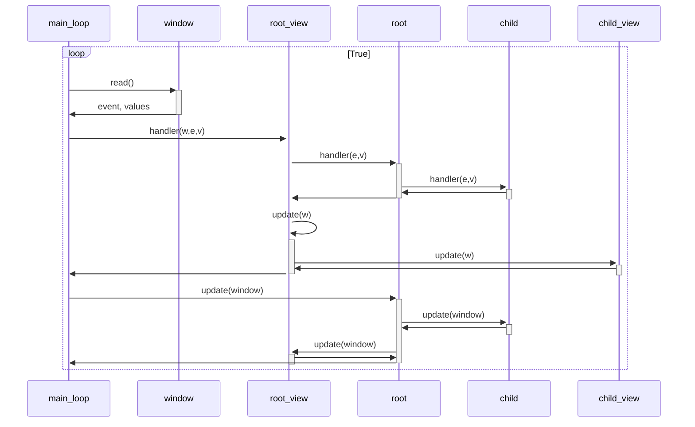

# One D&D Character Builder

## Design policy

* Race, Clazz は 抽象クラスとして扱い、Elf とか Bard のように具象クラスを持つ
* Model クラスに対して View クラスを定義する。コレクションクラスも持つ。
   * Char -> CharView 
   * Race -> RaceView, Races
   * Clazz -> ClassView, Classes
   * Elf -> ElfView
   * Bard -> BardView
   * Levels -> LevelsView
* 自分の View クラスで閉じない範囲のイベントは、
   * Char に update する
   * Char の内容に整合するように CharView で表示を update する
      * CharView.update は 各page.update を呼び出す



    
    ```mermaid
sequenceDiagram
    participant cook as コック
    participant kitchenware1 as フライパン

    cook ->>+ kitchenware1: ハンバーグを焼く
    Note over kitchenware1: 8分ほど待つ
    kitchenware1 -->>- cook: 焼き上がり
    Note right of kitchenware1: 竹串を刺して透明な汁が出たら完成
```